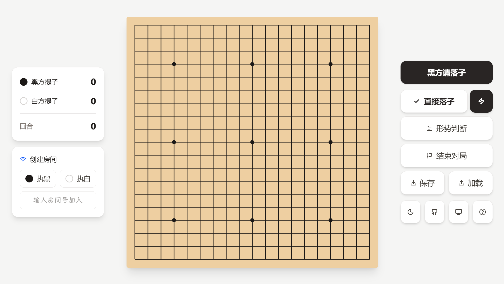

# 同步围棋



## 游戏规则

- 每手棋双方首先各自选择落子点（允许自尽）并同时亮出
- 若双方选择了相同的点，则该手无效，该点成为禁入点
- 若双方选择了不同的点，则该手有效，先将这两子落下，结算所有没有气的棋子标记为提子，然后提掉所有提子
- 若提子包含本回合所有落子，则落子点变为禁入点
- 禁入点可以作为棋子的气，双方之后不能再下在该点，直到选择了不同的点
- 无贴目

## 功能特性

- 🎮 本地双人对战
- 🌐 网络实时对战
- 📊 形势判断
- 💾 棋谱保存/加载
- ⚡ 快速模式
- 📱 响应式设计

## 技术栈

- **前端**: React 19 + TypeScript + Tailwind CSS v4
- **构建工具**: Vite 6
- **实时通信**: Socket.io
- **图标**: Lucide React

## 快速开始

### 环境要求

- Node.js 18+
- npm 或 yarn

### 安装依赖

```bash
# 前端依赖
npm install

# 服务端依赖
cd server && npm install
```

### 启动游戏

```powershell
# Windows: 使用启动脚本
./start.ps1

# 或手动启动
# 终端1 - 启动服务端
cd server && node index.js

# 终端2 - 启动前端
npm run dev
```

访问 <http://localhost:3000> 开始游戏

### 构建生产版本

```bash
npm run build
```

## 项目结构

```
SyncGo/
├── App.tsx           # 主应用组件
├── components/
│   └── Goban.tsx     # 棋盘组件
├── utils/
│   └── gameLogic.ts  # 游戏逻辑
├── server/
│   ├── index.js      # Socket.io 服务端
│   └── package.json  # 服务端依赖
├── public/
│   └── favicon.svg   # 网站图标
├── types.ts          # TypeScript 类型定义
├── constants.ts      # 常量配置
├── vercel.json       # Vercel 部署配置
└── start.ps1         # Windows 启动脚本
```

## 部署方案

### 推荐部署方式：Vercel + Railway

由于 Vercel 不支持 WebSocket，建议采用前后端分离部署方案：

#### 1. 部署后端到 Railway

1. 访问 [Railway.app](https://railway.app) 并登录
2. 创建新项目，选择 "Deploy from GitHub repo"
3. 选择你的仓库，设置：
   - **Root Directory**: `server`
   - **Build Command**: `npm install`
   - **Start Command**: `node index.js`
4. 部署完成后，获取生成的后端 URL（如 `https://syncgo.up.railway.app`）

#### 2. 部署前端到 Vercel

1. 访问 [Vercel](https://vercel.com) 并登录
2. 导入你的仓库
3. 配置项目：
   - **Framework Preset**: Vite
   - **Build Command**: `npm run build`
   - **Output Directory**: `dist`
4. 添加环境变量：
   - `VITE_SERVER_URL` = 你的 Railway 后端 URL
5. 点击 "Deploy"

#### 3. 配置环境变量

- **在 Railway 中**：添加 `FRONTEND_URL` 环境变量，值为你的 Vercel 前端地址
- **在 Vercel 中**：确保 `VITE_SERVER_URL` 环境变量正确设置

#### 4. 测试部署

- 访问 Vercel 生成的前端 URL
- 创建游戏房间，测试网络对战功能
- 邀请朋友加入房间，测试实时通信

### 其他部署选项

| 平台               | WebSocket 支持 | 免费额度              | 推荐度  |
| ---------------- | ------------ | ----------------- | ---- |
| **Zeabur**       | ✅            | 500MB 存储 + 1GB 流量 | ⭐⭐⭐⭐ |
| **Render**       | ✅            | 750小时/月           | ⭐⭐⭐  |
| **DigitalOcean** | ✅            | $6/月              | ⭐⭐⭐⭐ |

